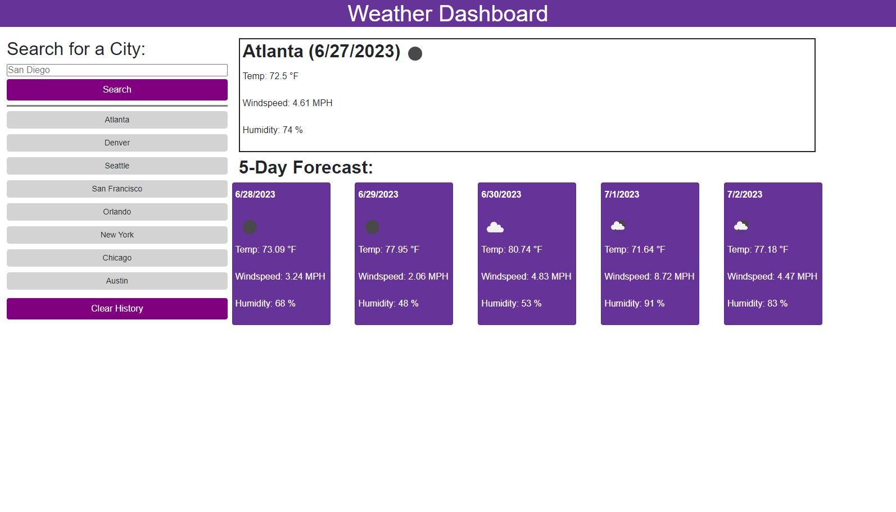

# Weather Dashboard

## Description
This Weather Dashboard allows a traveler view the weather outlook for multiple cities, so that they can plan a trip accordingly.

This project taught me how to use Bootstrap's grid system for responsive design, fetch data from the OpenWeather API, and create and add HTML/CSS dynamically using JavaScript. 

## Installation
N/A

## Usage
Simply visit https://fzhao888.github.io/Weather-Dashboard/ to get started. To get started, either type in a city name and click on search button or click on a previously searched city.  Once that this done, the current weather and 5-day forecast for that city will be rendered.

## Credits
OpenWeather API was used to fetch the data for current weather and 5-Day forecast.  In addition, https://getbootstrap.com/ was also used to figure out the bootstrap needed for this project. 

## License

MIT License